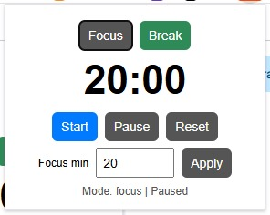
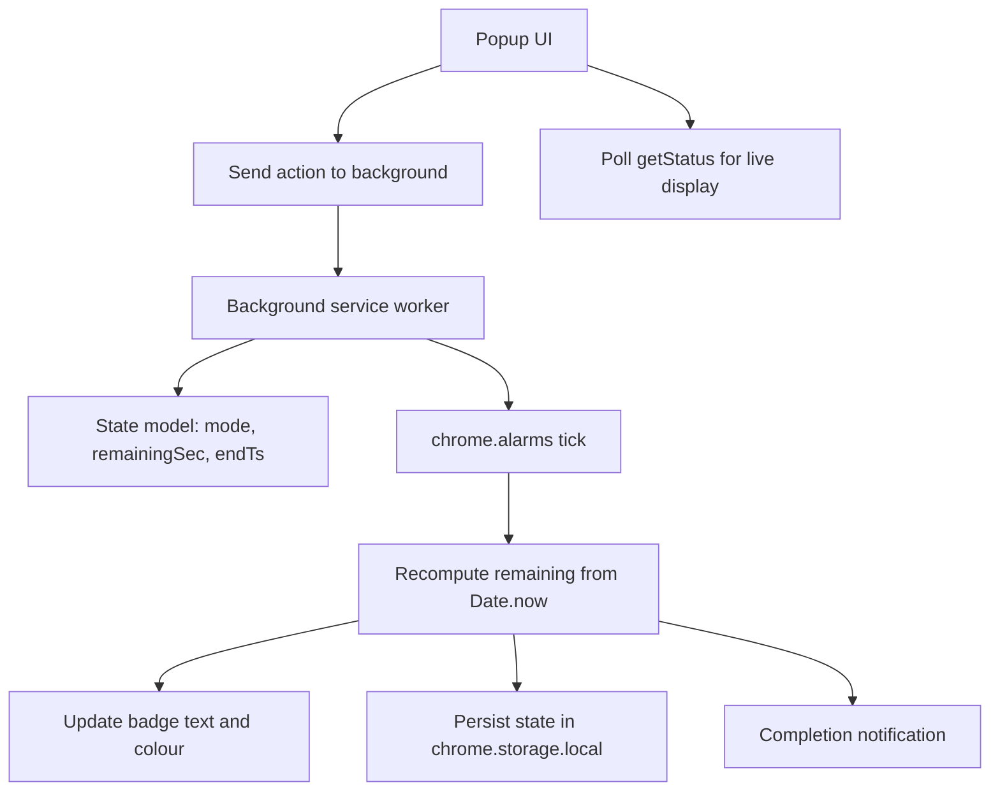

# Pomodoro Timer (Chrome Extension)

Stay focused, reduce context-switching, and keep momentum with a simple Pomodoro workflow directly in Chrome.

If you want a no-fuss timer that survives popup closes and still completes reliably in Manifest V3, this is built for you.

## Why use this extension

- Start work quickly with one click
- Switch between **Focus** and **Break** modes easily
- Keep visual awareness via the live badge countdown
- Avoid timer drift from MV3 service worker suspension
- Keep all state local to your browser

## Features

- Focus and Break modes
- Start, Pause, and Reset controls
- Configurable focus duration (1 to 120 minutes)
- Live icon badge countdown
- Completion notification
- Persistent timer state when popup is closed and reopened

## Screenshot



## Project structure

```text
README.md
src/
  manifest.json
  background.js
  popup.html
  popup.js
  icon.png
docs/media/
  pomodoro-ui.jpg
```

## Architecture



## Install

### Option 1: Chrome Web Store (recommended)

Install directly:

https://chromewebstore.google.com/detail/pomodoro-timer/geibgkighpdnoioegfhmkffoohkdnmdd

### Option 2: Load unpacked (developer mode)

1. Download or clone this repository
2. Open Chrome and go to `chrome://extensions/`
3. Enable **Developer mode**
4. Click **Load unpacked**
5. Select the `src` folder (where `manifest.json` is located)

## How to use

1. Open the extension popup
2. Choose **Focus** or **Break**
3. Optionally set custom focus minutes and click **Apply**
4. Click **Start**
5. Pause or reset at any time

## Technical reliability model (MV3-safe)

This extension avoids fragile interval-only timing.

- Running sessions store an absolute `endTs`
- Remaining time is recomputed from `Date.now()`
- `chrome.alarms` drives wake-up ticks and completion checks

This keeps countdown behaviour stable despite service worker lifecycle events.

## Permissions

- `storage`: persist timer state
- `alarms`: schedule periodic updates in MV3
- `notifications`: show completion alerts

## Privacy

- No external API calls
- No telemetry collection
- All timer state remains local in your browser

## License

Apache License 2.0
